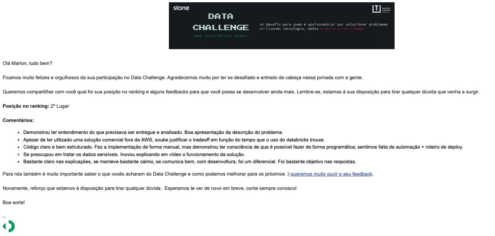

<h1 align="center">Stone Data Challenge</h1>
<h3 align="center">2º lugar nacional — Engenharia de Dados</h3>

<p align="center">
Projeto desenvolvido para o <b>Stone Data Challenge</b>, uma competição nacional voltada à resolução de problemas reais de dados.
</p>

<p align="center">
<a href="https://lp.stone.com.br/stone-data-challenge/">
  
</a>
</p>

---

## Resultado

🏆 **2º lugar nacional — trilha de Engenharia de Dados**

A solução foi avaliada considerando:

- Entendimento do problema
- Qualidade técnica da arquitetura
- Estrutura e clareza do código
- Tratamento de dados sensíveis
- Comunicação técnica na apresentação final

---

## Apresentação da solução

<p align="center">
<a href="https://www.youtube.com/watch?v=e6hEyb7Pcig">
  
</a>
</p>

<p align="center">
<b>Apresentação final — Stone Data Challenge</b><br/>
<sub>Pitch técnico utilizado na etapa final (storytelling + arquitetura da solução)</sub>
</p>

---

## Feedback oficial da banca

<p align="center">

</p>

**Principais destaques:**

- Excelente entendimento do problema e escopo
- Boa apresentação e clareza da solução
- Código organizado e bem estruturado
- Justificativa consciente de trade-offs técnicos
- Preocupação com dados sensíveis
- Comunicação objetiva e segura durante a defesa

---

## Sobre o desafio

O **Stone Data Challenge** é uma competição técnica nacional com foco em experiência prática em Dados.

Estrutura do processo:

1. Teste técnico classificatório  
2. Resolução de um case real  
3. Apresentação final (15 minutos) para a banca  

A avaliação final considera tanto a qualidade técnica da solução quanto a capacidade de comunicação e defesa das decisões.

---

## Objetivo da solução

Construir uma solução de engenharia de dados capaz de:

- Ingerir e preparar os dados do case
- Garantir qualidade e consistência
- Estruturar datasets analíticos
- Produzir informações confiáveis para tomada de decisão

O projeto priorizou:

- Clareza arquitetural  
- Pipeline reprodutível  
- Decisões técnicas justificadas  
- Robustez sob restrição de tempo  

---

## Abordagem técnica (visão geral)

- Ingestão e transformação de dados
- Modelagem analítica
- Validações de qualidade
- Tratamento de dados sensíveis
- Documentação técnica
- Storytelling executivo da solução

*(Ajuste esta seção conforme os artefatos específicos do repositório.)*

---

## Estrutura do repositório

```
.
├── data/           # Dados de entrada (quando permitido)
├── notebooks/      # Análises exploratórias
├── pipeline/       # Processamento e transformações
├── output/         # Resultados gerados
└── README.md
```

---

## O que este projeto demonstra

- Capacidade de resolver problemas reais de dados
- Design de pipelines sob restrições de tempo
- Tomada de decisão técnica e trade-offs
- Boas práticas de engenharia de dados
- Comunicação técnica para stakeholders

---

## Autor

**Marlon Ferrari**  
Analytics Engineer @ Nubank  
Professor de Ensino Superior  

YouTube: https://www.youtube.com/@profmarlonferrari  
LinkedIn: https://linkedin.com/in/marlonferrari  

---

## Observação

Este repositório contém apenas materiais que não violam os termos do desafio ou propriedade intelectual da Stone.
